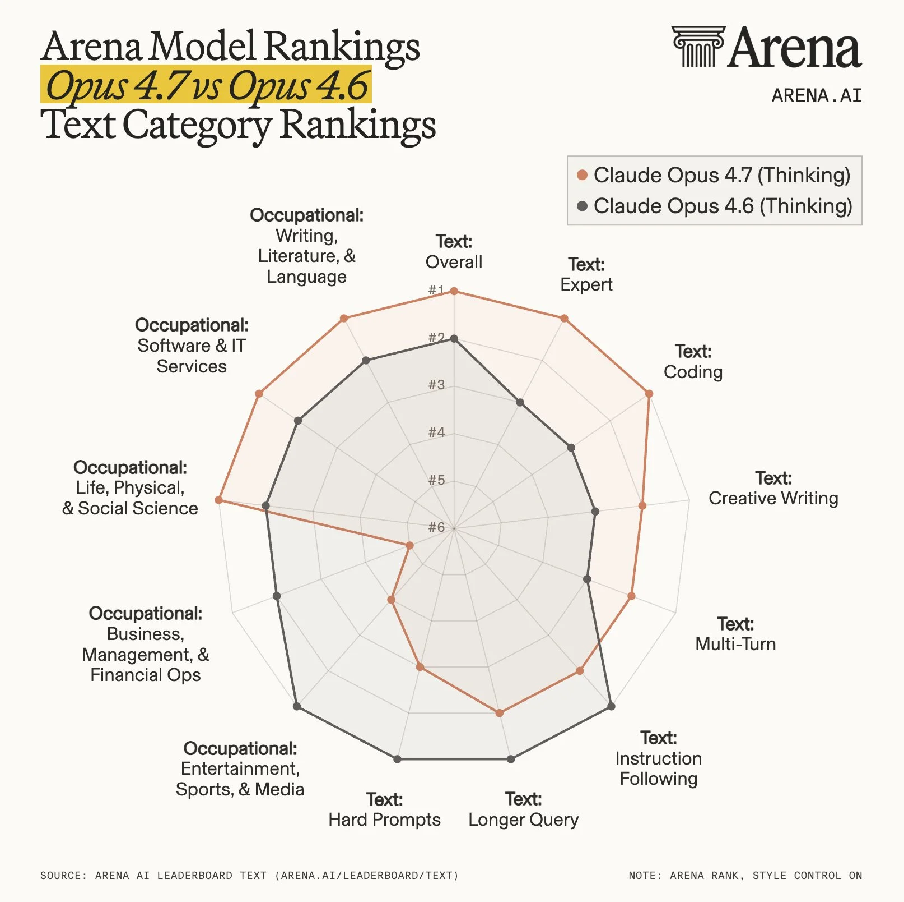
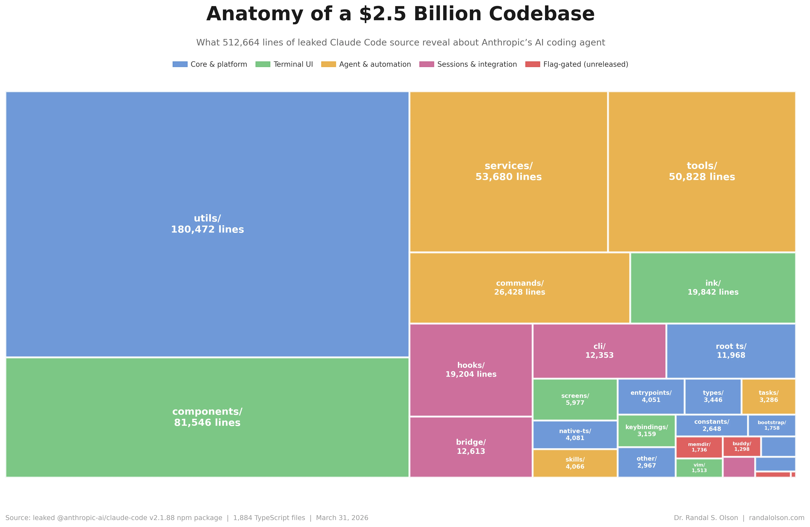
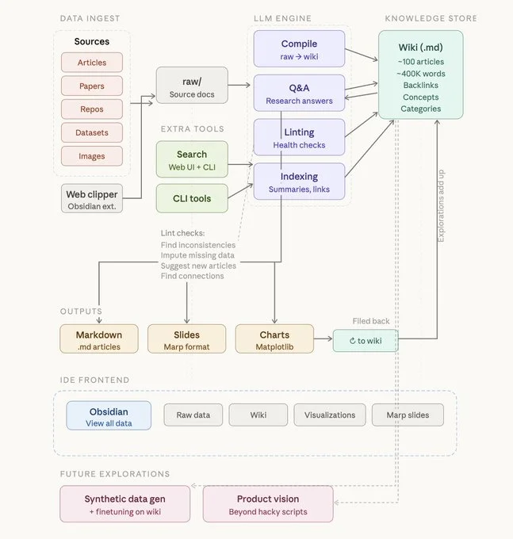

<!-- _paginate: false -->

  
Codemotion Madrid 2025

  

    Day 2 — Recap
  

  

  
Lo que nos contaron (y lo que nos quedamos pensando)

  

    
Antonio Peña

    
CaixaBank Tech

  

  

    
    
apenab.github.io/codemodetion-day2

  

<!--
NOTES — Title
Bienvenidos al resumen del día 2 de Codemotion Madrid.
-->

---

<!-- _class: invert -->

Bloque 1

# Desafíos de uso de la IA

<!--
NOTES — Section Desafíos
Primera charla del día. Reflexión necesaria en un momento de adopción masiva sin suficiente pensamiento crítico.
-->

---

## España: #6 en IA generativa

  

    
#6

    
mundo

  

  

    

      
⚠️

      
Alta adopción <strong>≠</strong> uso responsable

    

    

      
🎓

      
Código de IA: <strong>1.7×</strong> más defectos que el humano

    

    

      
📉

      
Ofertas junior en EE.UU.: <strong>−70%</strong>

    

  

<!--
NOTES — España ranking IA
España es el 6º país del mundo en adopción de IA generativa según el informe Global AI Adoption 2025 de Microsoft. El 78% de los profesionales la usa regularmente.
Pero alta adopción no implica uso maduro: el informe GitClear 2025 muestra que el código generado por IA tiene 1.7 veces más defectos que el humano, y en EE.UU. las ofertas para juniors han caído un 70%. Los que aprenden con IA sin criterio propio internalizan malos patrones sin saberlo.
-->

---

## La IA también puede atacarte

  

    
🎭

    
+1.633%

    
ataques deepfake vishing Q1 2025

  

  

    
📞

    
1 de cada 4

    
adultos: víctima de estafa por clonación de voz

  

  

    
💸

    
$40B

    
pérdidas por fraude deepfake en 2027

  

  Hay que aprender a <strong>reconocer</strong> cuándo la IA se usa en tu contra, no solo cómo usarla tú.

<!--
NOTES — IA como agresor
Los ataques de deepfake vishing crecieron un 1.633% de Q4 2024 a Q1 2025 (Pindrop). McAfee 2024: 1 de cada 4 adultos ha sido objetivo de una estafa por clonación de voz. Las pérdidas por fraude deepfake se estiman en $40B para 2027 (32% CAGR desde $12.3B en 2024).
El mensaje del ponente: no basta con saber usar IA. Hay que educar también en cómo detectar cuándo alguien la usa contra ti.
-->

---

## No pierdas el hábito de hablar con personas

  

    

      
🧠 Usa el planning mode de IA

      
Para estructurar y arrancar el pensamiento

    

    

      
💬 Comparte el plan con tu equipo

      
El debate humano mejora lo que la IA produce

    

  

  

    
🤖 Plan con IA

    
↓

    
👥 Revisión en equipo

    
↓

    
✅ Decisión validada

  

<!--
NOTES — Comunicación humana
El mensaje más importante de la charla: la IA nos ayuda a estructurar, pero la validación y el desafío de ideas tiene que seguir siendo humano. El planning mode de Claude Code es un buen punto de partida — úsalo para generar un plan inicial y luego llévaselo a tus compañeros para hacer challenging. No lo uses como output final.
-->

---

<!-- _class: invert -->

Bloque 2

# Migración GitLab → GitHub

---

## No es solo cambiar de URL

  

    

      🦊
      ⟶
      🐙
    

    

      
Pipelines CI/CD

      
Permisos & roles

      
Webhooks

      
Runners

      
Historial issues

      
Integraciones

    

  

  

    
⚙️ En CaixaBank Tech, en curso

    
Hay mucho trabajo silencioso detrás. Si alguien en tu org lo está haciendo, <strong style="color:#fde68a;">valóralo</strong>.

  

<!--
NOTES — Migración GitLab a GitHub
Migrar una organización entera de GitLab a GitHub no es solo cambiar de URL. Son meses de trabajo en pipelines, permisos, runners, webhooks, integraciones y cultura de equipo. En CaixaBank Tech estamos en ese proceso. La charla puso en valor ese esfuerzo que a menudo queda invisible.
-->

---

<!-- _class: invert -->

Bloque 3

# Modernización de COBOL

---

## El abismo entre paradigmas

  

    
🏛️

    
COBOL

    
Procedural Secuencial Sin objetos Sin tests

  

  

    ≠
  

  

    
☕

    
Java

    
Orientado a objetos Polimorfismo Herencia Ecosistema moderno

  

  No es traducción de sintaxis — es un cambio de <strong>paradigma completo</strong>. La IA sola no puede resolverlo.

<!--
NOTES — COBOL reto migración
El ponente fue muy claro: esto no es un problema resuelto. La brecha entre COBOL procedural y Java OOP es enorme — no es solo sintaxis, es una forma distinta de pensar los programas. Además, las codebases COBOL de los bancos tienen décadas, sin estándares claros, sin documentación, sin tests. Los LLMs tienen dificultades serias aquí porque no hay patrones que aprender. Cada codebase COBOL es un mundo diferente.
-->

---

## COBOL: el dinosaurio que no muere

  

    

      
800B

      
líneas en producción hoy

    

    

      
95%

      
transacciones ATM del mundo

    

    

      
$3T

      
en comercio diario

    

  

  

    

      
👴

      
Los expertos se jubilan. <strong>No hay relevo.</strong>

    

    

      
💰

      
Alta demanda + poca oferta = <strong>buen negocio</strong>

    

    

      
⏳

      
COBOL no desaparece en los próximos <strong>10 años</strong>

    

  

<!--
NOTES — Futuro COBOL
800 mil millones de líneas de COBOL en producción (The Stack 2024, actualización del dato de Reuters 2015 que era 220B). Mueve $3 trillones en comercio diario y el 95% de las transacciones ATM. Los programadores COBOL se están jubilando y no hay relevo generacional. Convertirse en experto COBOL hoy es un nicho muy bien pagado. El mensaje: COBOL no va a desaparecer, al menos no en la próxima década.
-->

---

<!-- _class: invert -->

Bloque 4 — Noticias del ecosistema

# Claude Opus 4.7 & GPT-5

---

## La batalla de los benchmarks

  

    
🏆 Claude Opus 4.7

    
Anthropic consolida su posición en la arena de LLMs.

  

  

    
⚡ GPT-5 recién lanzado

    
OpenAI responde. La carrera no para.

  

  

    Lo que era SOTA hace 6 meses hoy es middle-tier.
  

<!--
NOTES — Opus 4.7 y GPT-5
Esta semana ha sido intensa en releases. Claude Opus 4.7 de Anthropic apareció en la Chatbot Arena con resultados muy sólidos. Y casi simultáneamente, OpenAI lanzó GPT-5. El ritmo de mejora se ha acelerado tanto que los comparativos de hace meses ya no sirven. Para los que construimos sobre estos modelos: la volatilidad de las capacidades es real y hay que diseñar para ello.
-->

---

<!-- _class: invert -->

Bloque 4 — Noticias del ecosistema

# El gran filtrado de Claude Code

---

## 512K líneas expuestas durante horas

  

    
📦 31 de marzo — npm público

    
Source map completo de Claude Code subido por error.

  

  

    

      
59.8 MB

      
source map

    

    

      
~512K

      
líneas

    

    

      
~1.900

      
archivos

    

  

  

    Detectado en X, espejado en GitHub. Los source maps son un vector de exposición subestimado.
  

<!--
NOTES — Claude Code leak
El 31 de marzo Anthropic incluyó por error el source map de JavaScript de Claude Code en el paquete npm público. Un source map de 59.8 MB expuso ~512K líneas de código en ~1.900 archivos durante horas. Fue detectado por la comunidad en X y espejado en GitHub antes de que se pudiera retirar. El aprendizaje: revisar siempre qué va en los paquetes que publicáis. Los source maps son para debugging interno y nunca deberían llegar a producción pública.
-->

---

<!-- _class: invert -->

Bloque 4 — Noticias del ecosistema

# Knowledge Bases — Karpathy

---

## El contexto lo es todo

  

    
🗂️ Knowledge bases estructuradas

    
Para que el agente navegue bien el conocimiento del proyecto.

  

  

    
💡 Garbage in, garbage out

    
La calidad del contexto define la calidad del output. Siempre.

  

<!--
NOTES — Karpathy Knowledge Bases
Andrej Karpathy compartió su enfoque para vibe coding con agentes de IA. La clave: el modelo no improvisa bien sin contexto. Con una base de conocimiento bien estructurada — convenciones del proyecto, patrones preferidos, antipatrones — el código generado mejora drásticamente. Esto conecta directamente con el CLAUDE.md que usamos en nuestros proyectos: es exactamente ese tipo de knowledge base.
-->

---

<!-- _paginate: false -->

  
Codemotion Madrid 2025 — Day 2

  

    La IA avanza rápido. Nosotros también.
  

  

  

    
⚠️ Usa la IA con criterio

    
💬 No dejes de hablar con personas

    
🗂️ Cuida tu contexto

  

  

    
Antonio Peña

    
CaixaBank Tech

  

  

    
    
apenab.github.io/codemodetion-day2

  

<!--
NOTES — Closing
Tres mensajes del día: la IA no es neutra ni infalible, el debate humano sigue siendo insustituible, y la calidad de lo que le das a un agente determina la calidad de lo que recibes. Gracias.
-->
